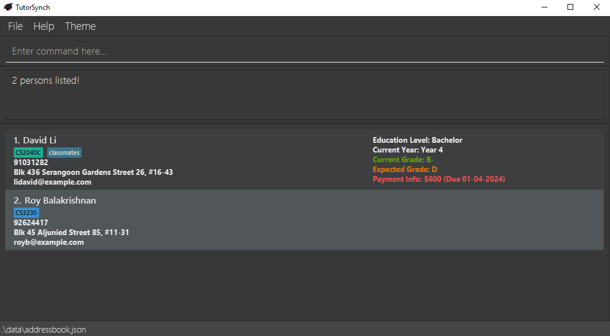

TutorSynch is a **desktop app built for independent tutors, designed to help manage student contacts, academic details 
and payments with ease**. It is **optimized for use via a Command Line Interface (CLI)** while still offering the 
benefits of a Graphical User Interface (GUI). If you can type fast, TutorSynch can handle your contact management, payment tracking 
and student data organisation more efficiently than traditional GUI-only apps.

* Table of Contents
{:toc}

--------------------------------------------------------------------------------------------------------------------

## Quick start

1. Ensure you have Java `17` or above installed in your Computer. 
   **Mac users:** Ensure you have the precise JDK version
   prescribed [here](https://se-education.org/guides/tutorials/javaInstallationMac.html).

2. Download the latest `.jar` file from [here](https://github.com/AY2425S2-CS2103-F15-2/tp/releases).

3. Copy the file to the folder you want to use as the _home folder_ for your TutorSynch.

4. Open a command terminal, `cd` into the folder you put the jar file in, and use the `java -jar tutorsynch.jar`
   command to run the application. 
   A GUI similar to the below should appear in a few seconds. Note how the app contains some sample data. 
   

5. Type the command in the command box and press Enter to execute it. e.g. typing **`help`** and pressing Enter will
   open the help window. 
   Some example commands you can try:

    * `list` : Lists all contacts.

    * `add n/John Doe p/98765432 e/johnd@example.com a/John street, block 123, #01-01` : Adds a contact named `John Doe`
      to the Address Book.

    * `delete 3` : Deletes the 3rd contact shown in the current list.

    * `purge` : Deletes all contacts.

    * `exit` : Exits the app.

6. Refer to the [Features](#features) below for details of each command.

--------------------------------------------------------------------------------------------------------------------

## Features

**:information_source: Notes about the command format:** 

* Words in `UPPER_CASE` are the parameters to be supplied by the user. 
  e.g. in `add n/NAME`, `NAME` is a parameter which can be used as `add n/John Doe`.

* Items in square brackets are optional. 
  e.g. `n/NAME [t/TAG]` can be used as `n/John Doe t/friend` or simply as `n/John Doe`.

* Items with `…` after them can be used less than or equals to 8 times, including zero times. 
  e.g. `[t/TAG]…` can be used as ` ` (i.e. 0 times), `t/cs4238`, `t/cs2103 t/GEA1000` etc.

* Any tags can be written as an alphanumeric tag containing no spaces and less than 10 characters
    * Optional: Tags can be appended with a `#` followed by 6 hexadecimal color code for a custom color. (i.e.
      `CS2040C#ED9E49`)
    * Tags without a hexadecimal color code appended will resolve to a default color.

* Parameters can be in any order. 
  e.g. if the command specifies `n/NAME p/PHONE_NUMBER`, `p/PHONE_NUMBER n/NAME` is also acceptable.

* Only use the [prefixes](#prefix) explicitly defined for a given command. Using unsupported prefixes—such as those from other
  commands—may result in them being interpreted as plaintext (i.e. `f/1000` is not a valid prefix for the `add` command
  and will not be parsed correctly). **Prefixes are strictly lower case**. 

* Commands that do not take in parameters (i.e. `help`, `list`, `exit`, `purge`, `sort`, `toggletheme`) will show error when arguments
  are provided.

* If you are using the PDF version of this document, be careful when copying and pasting commands that span multiple lines
  as space characters surrounding line-breaks may be omitted when copied over to the application.

:exclamation: **Constraints:** 
The intended use-case of TutorSynch application includes only the English language. 
Use of other language (i.e. Chinese characters) may result in TutorSynch to behave in unexpected ways.

:exclamation: **Constraints:** 
Parameters must conform to their respective formats and constraints; otherwise, the command may be rejected. All parameter constraints can be found in the [glossary](#fields-in-tutorsynch).

### Viewing help : `help`

Shows a message explaining how to access the help page. The help window will block any and all activity with the main
window until it is closed.

Format: `help`

### Adding a student : `add`

Adds a student to the address book.

Format:
`add n/NAME p/PHONE_NUMBER e/EMAIL a/ADDRESS [l/EDUCATION] [cy/CURRENT_YEAR] [cg/CURRENT_GRADE] [eg/EXP_GRADE] [t/TAG]…​`

* EDUCATION is an optional field, that can be used to store a student's Education Level (i.e. `Primary`, `Diploma`, `Junior College`, etc.)
* CURRENT_YEAR is an optional field, that can be used to store a student's Current Year info (i.e. `Grade 12`, `Year 1`, etc.)
* CURRENT_GRADE is an optional field, that can be used to store a student's Current Grade info (i.e. `B+`, `D-`, `FAIL`, etc.)
* EXP_GRADE is an optional field, that  can be used to store a student's Expected Grade info (i.e. `A+`, `C-`, `PASS`, etc.)

:bulb: **Tip:** Duplicate detection for repeated contacts are 
based on **EXACT** matching of NAMEs or **CASE-INSENSITIVE** matching of EMAILs. 
For example: `Jane Doe` (single-spaced) and `Jane  Doe` (double-spaced) will be treated as 2 distinct contacts. 
For example: `janedoe@email.com` and `JaneDoe@email.com` will be treated as duplicated contacts.

:bulb: **Tip:** A student can have less than or equals to 8
unique TAGs each (including 0).

:bulb: **Tip:** Tags names should be less than 10 characters long and 
should not contain spaces. 

:bulb: **Tip:**
You can add a hexadecimal color code to any TAG by appending `#RRGGBB` after the tag name.
For example: `t/CS2040#ED9E49`. This allows tags to be visually color-coded in the UI.

:exclamation: **Constraints:** 
For `add` command, the parameters EDUCATION, CURRENT_YEAR, CURRENT_GRADE, EXP_GRADE and TAG cannot be used with an empty string. 
(i.e. `add n/Benny p/12345678 e/benny@example.com a/Blk 123 cg/ eg/ t/` is invalid)

**Examples**:

* `add n/John Doe p/98765432 e/johnd@example.com a/John street, block 123, #01-01`
* `add n/Betsy Crowe t/friend e/betsycrowe@example.com a/Newgate Prison p/1234567 cg/C+ t/CS2030C`

### Listing all students : `list`

Shows a list of all students in the address book.

Format: `list`

### Editing a student : `edit`

Edits an existing student in the address book.

Format:
`edit INDEX [n/NAME] [p/PHONE] [e/EMAIL] [a/ADDRESS] [l/EDUCATION] [cy/CURRENT_YEAR] [cg/CURRENT_GRADE] [eg/EXP_GRADE] [t/TAG]… [t+/TAG_TO_APPEND]… [t-/TAG_TO_REMOVE]…`

* Edits the student at the specified `INDEX`. The index refers to the index number shown in the displayed student list.
  The index **must be a positive integer** 1, 2, 3, …​
* At least one of the optional fields must be provided.
* Existing values will be updated to the input values.

:bulb: **Tip:** Duplicate detection for repeated contacts are 
based on **EXACT** matching of NAMEs or **CASE-INSENSITIVE** matching of EMAILs. 
For example: `Jane Doe` (single-spaced) and `Jane  Doe` (double-spaced) will be treated as 2 distinct contacts. 
For example: `janedoe@email.com` and `JaneDoe@email.com` will be treated as duplicated contacts.

:bulb: **Tip:** A student can have less than or equals to 8
unique TAGs each (including 0).

:bulb: **Tip:** Tag name should be less than 10 characters long and 
should not contain spaces. 

:bulb: **Tip:**
You can add a hexadecimal color code to any TAG by appending `#RRGGBB` after the tag name.
For example: `t/CS2040#ED9E49`. This allows tags to be visually color-coded in the UI.

:bulb: **Tip:**
For `edit` command, the parameter TAG can be used with any varying amount of TAGs or strictly a single TAG prefix occurrence followed by an empty string.
If a TAG prefix is followed by an empty string (i.e. `edit 1 t/ cg/A+`), the edited student will be updated with **NO** tags.

:exclamation: **Constraints:** 
For `edit` command, the parameters TAG_TO_APPEND and TAG_TO_REMOVE cannot be used with an empty string. 
(i.e. `edit 1 t+/ cg/A+` is invalid)

:bulb: **Tip:**
For `edit` command, the parameters EDUCATION, CURRENT_YEAR, CURRENT_GRADE and EXP_GRADE can be used with an empty string to mark as non-applicable.
(i.e. `edit 1 cg/ eg/ t/CS2040C`)

**Examples**:

* `edit 1 p/91234567 e/johndoe@example.com` Edits the phone number and email address of the 1st student to be `91234567`
  and `johndoe@example.com` respectively.

#### Tag Editing : `t/`, `t+/`, `t-/`

* When editing tags, any number of `t/`, `t+/` or `t-/` may be provided, and the order of execution is as follows:

1. TAGs prefixed with `t/` form the new list of tags (overwriting the old tags), if none are provided, old list of tags
   is used for the next steps.
2. TAGs prefixed with `t+/` are added to the current list. If the tag already exists, the updated list remains unchanged
   as tags are necessary to be unique.
3. TAGs prefixed with `t-/` are removed from the list provided by the last step. If the tag to be removed does not
   exist, the app silently continues with the rest.
4. The final tag list is updated to the student, and should have less than or equals to 8 unique tags.

**Examples**:

* `edit 2 n/Betsy Crower t/` Edits the name of the 2nd person to be `Betsy Crower` and clears all existing tags.
* `edit 2 t-/Maths` Edits the tags of the 2nd person by removing `Maths` from existing list of tags.
* `edit 2 t/Maths t/Science t-/Science` Edits the tags of the 2nd person by clearing all existing tags and adding **only** `Maths`.
* `edit 1 t+/friend t+/CS2030C#1E3BC3` appends `friend` and `CS2030C#1E3BC3` to existing tags of the 1st person (without overwriting or
  removing).

### Bulk removal of tags: `untag`

Removes **all occurrences** of the specified tags from **all student records**.

Format: `untag t/TAG [t/TAG]...`

- Removes all matching tags from all student records.
- If a tag does not exist in any student record, it will be ignored.
- At least one TAG must be included for the command to work.

:exclamation: **Constraints:** 
For `untag` command, the parameter TAG cannot be used with an empty string. 
(i.e. `untag t/` is invalid)

**Examples**:

* `untag t/Math`  
  Removes the tag `Math` from all student records.
* `untag t/Math t/Science`  
  Removes the tags `Math` and `Science` from all student records.

### Updating a student's payment information : `payment`

Updates the payment information of an existing student in the address book.

Format: `payment INDEX [f/FEE] [d/PAYMENT_DATE] [s/PAYMENT_STATUS]`

* Updates the student at the specified `INDEX`. The index refers to the index number shown in the displayed student list.
  The index **must be a positive integer** 1, 2, 3, …​
* Provided fields will be updated with the input values. Any missing fields will be removed by default.
* If none of the optional fields are provided, the specified student's payment information will be removed.
* `FEE` should be an unsigned integer (positive, no decimals, and less than or equal to $2,147,483,647), and will be
  removed if entered as `0`. It can be used to store a Student's Payment Fee.
* `PAYMENT_DATE` should be in the format `DD-MM-YYYY`. It can be used to store a Student's Payment Date.
* `PAYMENT_STATUS` should be either `Paid` or `Waiting` (case-insensitive). It can be used to store a Student's Payment Status.

:exclamation: **Constraints:** 
For `payment` command, the parameters FEE, PAYMENT_DATE and PAYMENT_STATUS cannot be used with an empty string. 
(i.e. `payment 1 f/ d/ s/` is invalid)

**Examples**:

* `payment 1 f/1000 d/14-11-2000 s/paid` Updates the tutoring fee, payment date and status to be `1000`, `14-11-2000`
  and `paid` respectively.
* `payment 2` Removes the payment information of the 2nd student.

### Sorting the list of students : `sort`

Sorts the list of students alphabetically based on their name.

Subsequent additions are inserted at the bottom.

Format: `sort`

### Locating students by name : `find`

Finds students whose names contain any of the given keywords.

Format: `find KEYWORD [MORE_KEYWORDS]`

* The search is case-insensitive. e.g. `hans` will match `Hans`
* The order of the keywords does not matter. e.g. `Hans Bo` will match `Bo Hans`
* Only the name is searched.
* Only full words will be matched e.g. `Han` will not match `Hans`
* Persons matching at least one keyword will be returned (i.e. `OR` search).
  e.g. `Hans Bo` will return `Hans Gruber`, `Bo Yang`

**Examples**:

* `find John` returns `john` and `John Doe`
* `find li roy` returns `David Li`, `Roy Balakrishnan` 
  

### Filter list of students : `filter`

Filters list of students who match all filter conditions.

Format: `filter [l/EDUCATION] [cg/CURRENT_GRADE] [eg/EXP_GRADE] [t/TAG]…`

* Filters list to show all students who fulfill **ALL** filter conditions.
* At least one of the optional fields must be provided.
* Empty fields are accepted
    * If `[l/EDUCATION] [cg/CURRENT_GRADE] [eg/EXP_GRADE]` are empty e.g. `l/ cg/ eg/`,
      filter will show students without values in respective fields stated.
    * `[t/TAG]…` an empty tag field will trigger an error.

### Deleting a student : `delete`

Deletes the specified student from the address book.

Format: `delete INDEX`

* Deletes the student at the specified `INDEX`.
* The index refers to the index number shown in the displayed student list.
* The index **must be a positive integer** 1, 2, 3, …​

**Examples**:

* `list` followed by `delete 2` deletes the 2nd student in the address book.
* `find Irfan` followed by `delete 1` deletes the 1st student in the results of the `find` command.

### Switching the Theme of the program : `toggletheme`

* Switches the theme of the program from Dark Mode to Light Mode or vice versa.
* Currently selected theme will be saved to the as a User Preference Setting and loaded upon next boot.

Format: `toggletheme`

### Deleting multiple students : `clear`

Deletes multiple students:

* in sequence from a starting to ending index **OR**
* based on given tags (student is deleted if they have at least one of the provided tags).

Format: `clear i/START_INDEX...END_INDEX` OR `clear t/TAG [t/TAG]...`

* Index refers to the index number shown in the displayed student list.
* Indices must be **positive integers** 1, 2, 3, ...
* Starting index must be **strictly smaller** than ending index.
* Tags provided must be valid tags (color code not necessary) in the format prescribed above.
* At least one tag must be provided.
* Each student in the address book is checked for the tags provided.
* If the student has at least one tag that matches, they will be deleted.
* If hexadecimal for color coding is provided in tag, hexadecimal color will be ignored
* **IMPORTANT**: using both types of prefixes together will yield an error.

:exclamation: **Constraints:** 
For `clear` command, the parameter TAG cannot be used with an empty string. 
(i.e. `clear t/` is invalid)

**Examples**:

* `list` followed by `clear i/2...5` will delete students at indices 2, 3, 4 and 5 for a total of four deletions.
* `clear t/friends t/enemies` will delete students who have either the `friends` tag or `enemeies` tag.

### Purging all entries : `purge`

Purges all entries from the address book.

Format: `purge`

### Exiting the program : `exit`

Exits the program.

Format: `exit`

### Saving the data

TutorSynch data are saved in the hard disk automatically after any command that changes the data. There is no need to
save manually.

### Editing the data file

TutorSynch data are saved automatically as a JSON file `[JAR file location]/data/addressbook.json`. Advanced users are
welcome to update data directly by editing that data file.

:exclamation: **Caution:**
If your changes to the data file makes its format invalid, TutorSynch will discard all data and start with an empty data file at the next run. Hence, it is recommended to take a backup of the file before editing it. 
Furthermore, certain edits can cause TutorSynch to behave in unexpected ways (e.g., if a value entered is outside the acceptable range). Therefore, edit the data file only if you are confident that you can update it correctly.

--------------------------------------------------------------------------------------------------------------------

## FAQ

**Q**: How do I transfer my data to another Computer? 
**A**: Install the app on the other computer. After it runs once, it will create a default data file at
`[JAR file location]/data/addressbook.json`. To transfer your data, overwrite this file with the `addressbook.json` file
from your original computer.

:exclamation: **Caution:**
Before doing this, ensure that the data file is valid and has not been corrupted or manually edited in a way that breaks the expected format. Invalid or out-of-range values may cause TutorSynch to start with an empty data file or behave unpredictably. 
It's strongly recommended to make a backup of your data file before any manual edits or transfers.

--------------------------------------------------------------------------------------------------------------------

## Known issues

1. **When using multiple screens**, if you move the application to a secondary screen, and later switch to using only
   the primary screen, the GUI will open off-screen. The remedy is to delete the `preferences.json` file created by the
   application before running the application again.
2. **If you need to see your truncated NAME, EMAIL or ADDRESS**, increase your window size for the application until it
   is no longer truncated.
3. **EMAIL may still be truncated**, if it is too long even when window size is the maximum
4. **When adding/editing many tags**, in certain scenarios where the tags begin to wrap (especially on lower screen
   resolution), the tags may inadvertently overlap onto the remaining Person's information field, as shown in the
   screenshot below.
   
   The remedy is to click on the specific Person's Card, which will trigger a CSS style update, so that the wrapping
   works as intended.
   

5. **When local system date changes occurs**, in certain scenarios where a student's `Payment Info` would be displayed 
   from one color to another, the visual feedback of these changes might not be properly displayed. The remedy is to
   click on the specific Person's Card, which will trigger a CSS style update to re-render the Peron's Payment Info.
   For more information about the issue, click [here](https://github.com/AY2425S2-CS2103-F15-2/tp/issues/147).
--------------------------------------------------------------------------------------------------------------------

## Glossary
### Fields in TutorSynch
The descriptions for the fields state the intentions of the dev team. However, as long as the constraints are kept to, users may freely utilise the fields to suit their own needs.
#### Prefix
A prefix is used to denote the start of a field when using commands that require multiple inputs. A prefix always follows the following format: a one or two letter **lowercase** shortcode followed by a forward slash. E.g., `n/`

#### Index : `INDEX`
- **Prefix**: none
- **Used in**: [`edit`](#editing-a-student--edit), [`delete`](#deleting-a-student--delete), [`payment`](#updating-a-students-payment-information--payment)
- **Other Versions**:
  - Sequence of Indices : `i/START_INDEX...END_INDEX` used in [`clear`](#deleting-multiple-students--clear)

The numerical identifier used to refer to a contact in a list. Indices are not static, they are dynamically generated based on the current **visible** list that is being shown in TutorSynch.  
For example, when using the `find` or `filter` command, the generated results will have their own indices. These indices can then be used in other commands.

#### Name : `n/NAME`
- **Prefix**: `n/`
- **Used in**: [`add`](#adding-a-student--add), [`edit`](#editing-a-student--edit)

Stores the name of a contact. This could be the name of a student, a parent, etc. (depending on the needs of the user)

:exclamation: **Constraints:** 
NAME must be between 1 and 65 characters. It may also contain spaces and these special characters (`,/'`).   (Do note that extremely long NAME may be truncated unless you increase the window size)

#### Phone number : `p/PHONE_NUMBER`
- **Prefix**: `p/`
- **Used in**: [`add`](#adding-a-student--add), [`edit`](#editing-a-student--edit)

Stores phone numbers. The field is not restricted to merely numbers, granting users flexibility.  
For example, a user may choose to indicate multiple phone numbers, with one being the primary/preferred number, or even refer to another contact altogether.  
**Example**: `Preferred:12344567 Alt:99999999` or `Call parent: Jonathan Hill`

:exclamation: **Constraints:** 
PHONE must be between 3 and 85 characters.   (Do note that extremely long PHONE may be truncated unless you increase the window size) 
PHONE may include digits, letters (A–Z, a–z), spaces, and the following special characters: `+`, `(`, `)`. 
**Example**: `(HP) +65 12345678 (Office) 87654321`

#### Email : `e/EMAIL`
- **Prefix**: `e/`
- **Used in**: [`add`](#adding-a-student--add), [`edit`](#editing-a-student--edit)

Stores a single email address. This could be the email of a student, a parent, etc. (depending on the needs of the user)

:exclamation: **Constraints:** 
EMAIL must be between 1 and 254 characters.   (Do note that extremely long EMAIL may be truncated even after you increase the window size) 
EMAIL should also be of the format `local-part@domain` such that: 
1. The local-part should only contain alphanumeric characters and these special characters (`+_.-`). The local-part may not start or end with any special characters and each special character must be separated by at least 1 alphanumeric character. 
2. This is followed by a '@' and then a domain name. The domain name is made up of domain labels separated by periods. The domain name must: 
    * end with a domain label at least 2 characters long. 
    * have each domain label start and end with alphanumeric characters. 
    * have each domain label consist of alphanumeric characters, separated only by hyphens, if any. 
    * have minimally 2 domain labels separated by at least 1 '.' special character. 
    * separate each special character with at least 1 alphanumeric character. 

#### Address : `a/ADDRESS`
- **Prefix**: `a/`
- **Used in**: [`add`](#adding-a-student--add), [`edit`](#editing-a-student--edit)

Stores an address. This could be the home address of a student, venue of tution session, etc. (depending on the needs of the user)

:exclamation: **Constraints:** 
ADDRESS must be between 1 and 85 characters.   (Do note that extremely long ADDRESS may be truncated unless you increase the window size)

#### Education : `l/EDUCATION`
- **Prefix**: `l/` (Lowercase 'L')
- **Used in**: [`add`](#adding-a-student--add), [`edit`](#editing-a-student--edit), [`filter`](#filter-list-of-students--filter)

Stores the education level of a student, if applicable. Users may use this to track the current level of education of the contact (e.g., primary, secondary, tertiary, etc.)

:exclamation: **Constraints:** 
EDUCATION must be alphanumeric and may include spaces, with a maximum of 30 characters. 
(Do note that extremely long EDUCATION values may be truncated unless you increase the window size)
It may also be left empty to indicate no education level assigned.

#### Current Year : `cy/CURRENT_YEAR`
- **Prefix**: `cy/`
- **Used in**: [`add`](#adding-a-student--add), [`edit`](#editing-a-student--edit), [`filter`](#filter-list-of-students--filter)

Stores the current year of a student, if applicable. Typically used in conjunction with [Education Level](#education--leducation) (e.g., "Primary 1" being: `l/primary cy/1`)

:exclamation: **Constraints:** 
CURRENT_YEAR must be alphanumeric and may include spaces, with a maximum of 30 characters. 
(Do note that extremely long CURRENT_YEAR values may be truncated unless you increase the window size)
It may also be left empty to indicate no year assigned.

#### Current Grade : `cg/CURRENT_GRADE`
- **Prefix**: `cg/`
- **Used in**: [`add`](#adding-a-student--add), [`edit`](#editing-a-student--edit), [`filter`](#filter-list-of-students--filter)

Stores the current grade of a student, if applicable.

:exclamation: **Constraints:** 
CURRENT_GRADE must be one of the following (case-insensitive): A, A+, A-, B, B+, B-, C, C+, C-, D, D+, D-, E, E+, E-, F, F+, F-, CS, CU, S, U, PASS, FAIL. 
It may also be left empty to indicate no grade assigned.

#### Expected Grade : `eg/Expected_GRADE`
- **Prefix**: `eg/`
- **Used in**: [`add`](#adding-a-student--add), [`edit`](#editing-a-student--edit), [`filter`](#filter-list-of-students--filter)

:exclamation: **Constraints:** 
EXP_GRADE must be one of the following (case-insensitive): A, A+, A-, B, B+, B-, C, C+, C-, D, D+, D-, E, E+, E-, F, F+, F-, CS, CU, S, U, PASS, FAIL. 
It may also be left empty to indicate no grade assigned.

#### Payment Fee: `f/FEE`
- **Prefix**: `f/`
- **Used in**: [`payment`](#updating-a-students-payment-information--payment)

Stores the fee amount to be paid by a student, if applicable.

:exclamation: **Constraints:** 
FEE must be a non-negative integer (i.e., 0 or greater) and must not exceed the maximum value of a 32-bit signed integer (2,147,483,647). 
`0` may be used to indicate no payment fee is assigned. It may not be left as an empty value.

#### Payment Date: `d/PAYMENT_DATE`
- **Prefix**: `d/`
- **Used in**: [`payment`](#updating-a-students-payment-information--payment)

Stores the due date of the payment of a student, if applicable.

:exclamation: **Constraints:** 
PAYMENT_DATE must follow the date format `dd-MM-yyyy` (i.e. 13-01-2025, 14-11-2000). 
Invalid formats such as `yyyy-MM-dd` (i.e. 2000-01-20) or incorrect dates (e.g., 32-01-2020, 00-00-0000) are not allowed.  
Dates are limited to 200 years before and after the current date.  
E.g., if today is 07-04-2025, valid date range is from 07-04-1825 to 07-04-2225 (inclusive), invalid dates include 06-04-1825 and 08-04-2225.  
It may not be left as an empty string.

#### Payment Status: `s/PAYMENT_STATUS`
- **Prefix**: `s/`
- **Used in**: [`payment`](#updating-a-students-payment-information--payment)

Stores the status of payment (`waiting` or `paid`) of a student, if applicable.

:exclamation: **Constraints:** 
PAYMENT_STATUS must be either "paid" or "waiting" (case-insensitive). 
It may not be left as an empty string.

#### Tag : `t/TAG`
- **Prefix**: `t/`
- **Used in**: [`add`](#adding-a-student--add), [`edit`](#editing-a-student--edit), [`filter`](#filter-list-of-students--filter), [`untag`](#bulk-removal-of-tags-untag), [`clear`](#deleting-multiple-students--clear)
- **Other Versions**: 
  - Tag to append : `t+/TAG_TO_APPEND` in [`edit`](#editing-a-student--edit) 
  - Tag to remove : `t-/TAG_TO_REMOVE` in [`edit`](#editing-a-student--edit)

Tags are a short **single-word** label consisting of alphabets or numbers. Users can freely colour tags by providing a color hex code (e.g., #FFFFFF) immediately after the tag.
Tags can be a way to categorise contacts, examples of which could be by subjects (English, Maths, etc.), modules (CS2040, etc.), identifiers (friends, family, etc.) and more.

:exclamation: **Constraints:** 
Each TAG name (before the optional #HEX code, including TAG_TO_APPEND and TAG_TO_REMOVE) must be alphanumeric containing no spaces and at most 10 characters.

:exclamation: **Constraints:** 
TAG (including TAG_TO_APPEND and TAG_TO_REMOVE) can include an optional hexadecimal color code in the format #RRGGBB (e.g., t/cs2040#FFAABB).

:exclamation: **Constraints:** 
Two TAGs are considered equal if their names (i.e., the portion before the optional `#HEX` color code) match **case-insensitively**, regardless of whether or not they include a color code. 
For example: `CS2040`, `cs2040`, and `cs2040#FFAABB` are all treated as the same TAG. 
As such, when assigning TAGs, ensure that **no more than 8 unique TAG names** (ignoring case and color codes) are used per student.

--------------------------------------------------------------------------------------------------------------------

## Command summary

| Action      | Format, Examples                                                                                                                                                                                                                                             |
|-------------|--------------------------------------------------------------------------------------------------------------------------------------------------------------------------------------------------------------------------------------------------------------|
| **Add**     | `add n/NAME p/PHONE_NUMBER e/EMAIL a/ADDRESS [l/EDUCATION] [cy/CURRENT_YEAR] [cg/CURRENT_GRADE] [eg/EXP_GRADE] [t/TAG]…`   e.g., `add n/James Ho p/22224444 e/jamesho@example.com a/123, Clementi Rd, 1234665 cg/D t/CS2030C t/friends`                   |
| **Purge**   | `purge`                                                                                                                                                                                                                                                      |
| **Delete**  | `delete INDEX`  e.g., `delete 3`                                                                                                                                                                                                                          |
| **Clear**   | `clear i/START_INDEX...END_INDEX` OR `clear t/TAG [t/TAG]`                                                                                                                                                                                                   |
| **Edit**    | `edit INDEX [n/NAME] [p/PHONE_NUMBER] [e/EMAIL] [a/ADDRESS] [l/EDUCATION] [cy/CURRENT_YEAR] [cg/CURRENT_GRADE] [eg/EXP_GRADE] [t/TAG]… [t+/TAG_TO_APPEND]… [t-/TAG_TO_REMOVE]…`  e.g.,`edit 2 n/James Lee e/jameslee@example.com t+/CS2040C#1E2C4D`       |
| **Untag**   | `untag t/TAG [t/TAG]...`  e.g., `untag t/Math t/Science`                                                                                                                                                                                                  |
| **Payment** | `payment INDEX [f/FEE] [d/PAYMENT_DATE] [s/PAYMENT_STATUS]`  e.g., `payment 1 f/1000 d/14-11-2000 s/paid`                                                                                                                                                 |
| **Find**    | `find KEYWORD [MORE_KEYWORDS]`  e.g., `find James Jake`                                                                                                                                                                                                   |
| **Sort**    | `sort`                                                                                                                                                                                                                                                       |
| **Filter**  | `filter [l/EDUCATION] [cg/CURRENT_GRADE] [eg/EXP_GRADE] [t/TAG]…`                                                                                                                                                                                            |
| **List**    | `list`                                                                                                                                                                                                                                                       |
| **Help**    | `help`                                                                                                                                                                                                                                                       |
| **Switch Theme** | `toggletheme`                                                                                                                                                                                                                                                |
| **Exit**    | `exit`                                                                                                                                                                                                                                                       |
